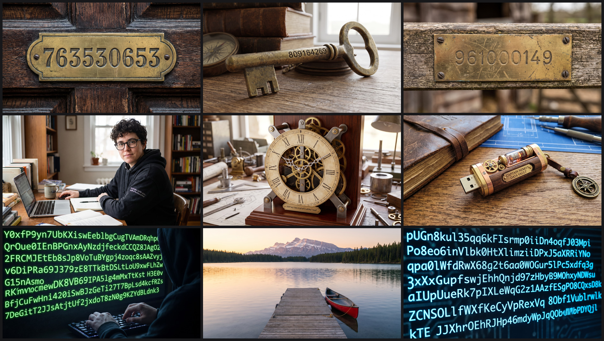
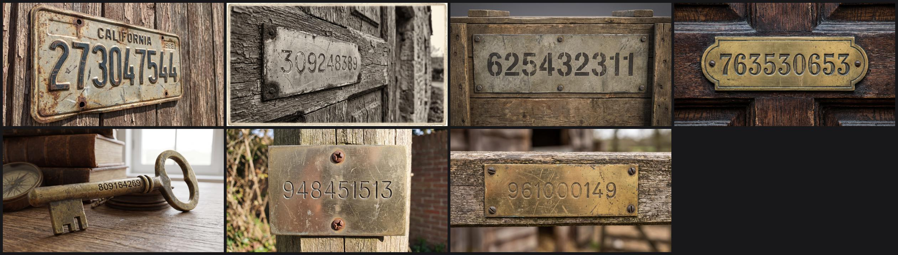
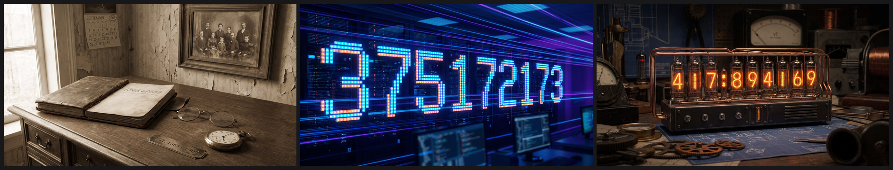
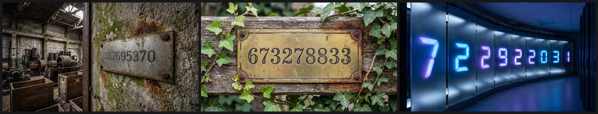
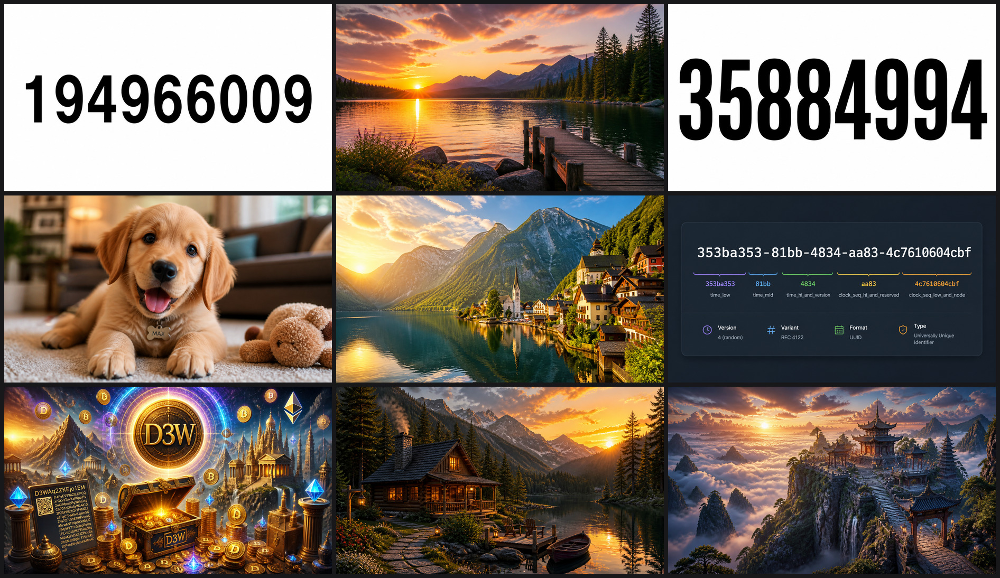
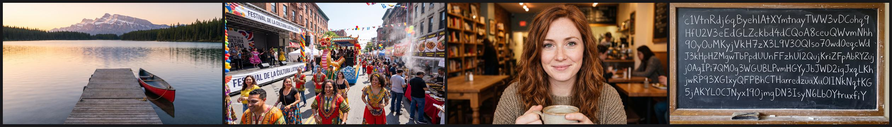

# I wonder what happens if we feed random data to an image generator?

No adjectives. No scene. No style. Just a random number, a UUID, or 256
characters of noise, handed to a state-of-the-art image model.

This is not a benchmark, and nothing here is a test the models can pass or fail.
We never gave them a brief. We handed them nonsense and watched what they did
with it — which is a way of poking at what the models bring to the table on
their own: their priors, their defaults, and where their tendency to invent
kicks in.

Three services, nine images each. They did three completely different things.

---

## The short version

| | Google Gemini 3 Pro Image | OpenAI gpt-image-2 | Stable Diffusion 3.5 Large |
|---|---|---|---|
| **Reproduces the string?** | Yes — 36 characters, exactly | Yes | No, never |
| **Interprets it?** | Always | Sometimes, as documentation | Not at all |
| **Typical output** | An invented object carrying the string | A spec sheet *or* an unrelated landscape | An arbitrary photograph |
| **Visual variety** | Narrow | Bimodal, nothing in between | Wide |

Only Stable Diffusion treats the input as what it literally is: a string with no
meaning. The other two reach for meaning every time — and reach for **opposite
kinds** of meaning. Gemini invents a story. OpenAI writes documentation.

---

## What we fed them

Three prompt types, three samples each, per service.

| Mode | Example | Why this one |
|---|---|---|
| `int` | `763530653` | The simplest random input we could think of. |
| `uuid` | `354974e2-1bc6-41a5-a432-e834ac716cef` | Longer. Worth noting: a UUID *looks* like an identifier, so this prompt probably nudges the models toward treating it as one. That is a bias we introduced, not something we discovered. |
| `long` | 256 random letters and digits | Long enough that it stops looking like a label. |

Everything renders 16:9. Gemini outputs 2752×1536 — its API takes size *tiers*
rather than pixel dimensions — and the other two output 1344×768.

---

## Google Gemini 3 Pro Image



*Rows: integers, UUIDs, 256-character strings.*

**It always finds something to write the string on.** A brass house number on a
door. A plaque screwed to a weathered gate. An antique key with the digits
stamped into the shaft. A UUID embroidered on a hoodie sleeve; another engraved
on a skeleton clock.

**The text is exact.** We cropped and checked: the 36-character UUID
`354974e2-1bc6-41a5-a432-e834ac716cef` is character-perfect, hyphens included,
as is the one that wrapped across two lines on a hoodie sleeve.

### The one result we sampled properly

The strong impression from the first three integers was a house style — brass,
wood, warm light. Three samples is not enough to claim that, so we ran more.



At **n=7, all seven** are the same composition: a metal tag or plate carrying the
number, mounted on weathered wood, shot close with shallow depth of field.

Sampling also **corrected** us. On three images we noted the model never reached
for a licence plate — an obvious home for a number. The fourth sample is a
California licence plate. Small samples produce confident wrong statements about
what a model "never" does.

Seven is still seven, and this is one prompt type on one model. Treat it as a
strong hint, not a measurement.

### At 256 characters it comes apart

The antique look disappears, replaced by green terminals and circuit boards — the
string now reads as *code* rather than as an identifier. Transcription holds for
roughly the first 70 characters and then decays: a duplicated `3x`, a dropped
`u`, and eventually a 7-character run (`ETRvWVu`) simply missing. Half of all
attempts at this length returned `finish_reason=NO_IMAGE`, a flat refusal that
never happened at 9 or 36 characters.

### Asking it to invent

We tried `Let yourself be inspired by this number: <n>` and got **zero images,
nine times in a row**. The phrasing reads as conversation, so the model wants to
*talk about* the number; with the API restricted to image output, it has nothing
it is allowed to emit.

What it says instead is the most surprising thing here. Unprompted, it read
`931360149` as a Unix timestamp — "Wednesday, July 7, 1999, 15:09:09 UTC" — and
factored `309324004` into `2² × 11 × 7,030,091`. **Both are exactly correct**,
weekday included, and 7,030,091 really is prime. Invited to invent, it did
verified arithmetic.

Adding `Create an image.` brings the pictures back and finally breaks the
antique attractor:



We also tried telling it outright not to depict the string —
`Create an image. Use the following as pure inspiration, not as a description:
<n>`. It made no difference:



All three still render the digits, and two are back to a metal plate on a
weathered surface. An explicit instruction not to transcribe does not stop it
transcribing.

Back in the `Create an image.` run, for `186561909` the model **split the digits** — `1865` and `1909` — read them as
a date range, and built a genealogy office around it: ledger, pocket watch,
family portrait, a plaque reading "EST. 1865 – 1909". Then it hung a September
1909 calendar on the wall, and the weekday grid is historically correct.
September 1909 did begin on a Wednesday.

---

## OpenAI gpt-image-2



*Rows: integers, UUIDs, 256-character strings.*

**It is bimodal, with no middle ground.** Either the string becomes pure
typography or technical content with no scene at all, or it is dropped entirely
in favour of an unrelated landscape. Gemini's move — embedding the string inside
an invented world — does not appear.

Two of three integers came back as black digits on plain white. Two of three
UUIDs were a puppy and an alpine village, with no string anywhere.

**And then there is the third UUID.** It produced an **RFC 4122 field diagram**:
the UUID split into `time_low` / `time_mid` / `time_hi_and_version` /
clock-sequence / node, colour-coded, annotated with Version 4 (random), Variant
RFC 4122, Format UUID.

We checked it. Version and variant are **correct** — identifying the RFC 4122
variant means reading `aa` as binary `10101010` and looking at the top bits. But
it labelled `aa83` as `clock_seq_hi_and_reserved`, which is really two fields,
and called the node `clock_seq_low_and_node`.

That is the only factual error any model made anywhere in this project. It got
the bit-level parsing right and the field boundaries wrong.

**No prompt filtering.** All three 256-character prompts went straight through.

---

## Stable Diffusion 3.5 Large


*Rows: integers, UUIDs, 64-character strings (see below).*

Nine images: a coastal stone gateway, a container ship, ranks of hard-hatted
workers, men in suits on a hillside, two women leaping over water, a golden
robotic bee in a snowy forest.

**Not one contains text. Not one relates to its prompt.** Integers and UUIDs are
indistinguishable in the output, which is the giveaway — neither carries meaning
this model can reach.

Note what "arbitrary" actually looks like here: not noise, but perfectly
coherent, well-composed photographs *of nothing in particular*.

### Why there is no 256-character row

Every attempt was rejected with `Filter reason: prompt` — a content filter, not
a model refusal. Working out *what* trips it took a few rounds, and our first
two explanations were both wrong.

Our first guess was length. Wrong: 1600 characters of English prose passes.

The obvious next guess is **token count** — random strings tokenize badly, and
SD 3.5's CLIP-L and CLIP-G encoders only take 77 tokens. Also wrong: that same
1600-character prose is ~336 tokens and passes, while a blocked 128-character
random string is only 91. (Prompts over the encoder limit get truncated, not
rejected — the filter is a separate stage.)

What actually predicts it is the length of the longest **unbroken run** of
high-entropy characters. Token counts below are means over 200 samples using
`cl100k_base` as a stand-in, since SD 3.5's own tokenizers are not exposed
through Bedrock:

| Prompt | Chars | ~Tokens | Result |
|---|---|---|---|
| Random, contiguous | 96 | 69 | passes |
| Random, contiguous | 112 | 80 | **blocked** |
| `"boat " × 51` | 255 | 52 | passes |
| English prose | 1600 | 336 | passes |
| Random, **spaces every 16** | 256 | 188 | passes |
| Random, **spaces every 64** | 256 | 184 | passes |

The same 256 random characters that are always blocked as one run pass cleanly
when broken up by spaces — same characters, same entropy, *more* tokens. The
threshold sits between 96 and 112 contiguous characters.

That is the shape of a base64 blob or an encoded payload, which is presumably
the point: it reads as an obfuscation attempt. It is a jailbreak heuristic, not
a limit on length, entropy, or tokens.

Since 64-character strings pass comfortably, this repo has a `rand64` mode, and
that is what fills the third row above.

---

## Two hypotheses we tested and dropped

**"The canoe image must be in there somewhere."** One 256-character prompt
produced a serene mountain lake with a red canoe — no text, no apparent link to
the input. A good hypothesis: tokenizers are built to find common subwords, so
maybe the string happened to contain something boat-shaped.

We ran the identical string four more times:



A lake, a Latin street festival, a woman in a café, and the string written on a
blackboard. No water association recurred. The string also contains no
water-related substring, and tokenizing it yields exactly two alphabetic
fragments of three or more characters — `ared` and `ceu`.

So the canoe was one draw from a high-variance distribution, not a hidden
association. This also settles something bigger: the same prompt, same model,
same settings produces radically different *strategies* — transcribe it, ignore
it, decorate around it. The behaviour is sampled, not determined by the input.

**"The filter is about entropy."** Covered above — it is about contiguous runs.

---

## What is actually known about these models

It is tempting to explain all this as "the new models have a language model
bolted on the front". That phrasing does not survive checking, so here is what
is actually documented.

**Stable Diffusion 3.5 Large** is fully public: a Multimodal Diffusion
Transformer (MMDiT) with three frozen text encoders — OpenCLIP-ViT/G and
CLIP-ViT/L, both 77-token context, plus T5-XXL. Open weights, published
architecture.

**Gemini 3 Pro Image and gpt-image-2 do not publish their architectures.** What
Google does say about the Gemini family is that it is *natively* multimodal —
trained across modalities from the start rather than having a vision component
attached to a text model. If that description holds for the image model, then
"bolted on" is close to backwards.

So the honest claim here is behavioural, not architectural: **two of these
models demonstrably read, parse and reason about the string, and one
demonstrably does not.** Whether that comes from a separate language component,
an integrated multimodal one, or a captioning stage in the training data, we
cannot tell from the outside — and nothing in this repo distinguishes them.

---

## Run it yourself

Requires [uv](https://docs.astral.sh/uv/) and credentials for whichever service
you want. No keys are stored in this repo — each backend uses its vendor's own
standard mechanism.

```bash
git clone https://github.com/zalez/randomimage.git
cd randomimage
uv run randomimage --backend openai
```

Reproduce a full 3×3 with a contact sheet:

```bash
uv run randomimage --backend gemini --mode int uuid long --count 3 --sheet
```

Try your own string:

```bash
uv run randomimage --backend stability --prompt "hello world" --count 2
```

```
--backend  gemini | openai | stability          (required)
--mode     int | uuid | long | rand64 | inspired | inspired_img | inspired_pure
--prompt   send this exact text instead of a generated one
--count    images per mode                      (default 1)
--out      output directory                     (default images/)
--retries  extra attempts when a service declines (default 3)
--sheet    also write contact-sheet.png
```

Services decline fairly often here, so retries are on by default and a refusal
prints the reason the service gave.

### Credentials

**OpenAI** — the SDK reads `OPENAI_API_KEY` by itself. Create a key at
[platform.openai.com/api-keys](https://platform.openai.com/api-keys):

```bash
export OPENAI_API_KEY=sk-...          # bash / zsh
set -Ux OPENAI_API_KEY sk-...         # fish, persists across sessions
```

**Google** — Application Default Credentials, plus a Google Cloud project with
billing and the Vertex AI API enabled:

```bash
gcloud auth application-default login
gcloud auth application-default set-quota-project YOUR_PROJECT_ID
```

The second command matters: user credentials belong to a person, not a project,
so without it the SDK has no project to bill. A service account key at
`~/.config/gcloud/application_default_credentials.json` works too and skips that
step, because a key names its own project.

**Stability via AWS Bedrock** — standard boto3 credential resolution, so the
`default` profile unless `AWS_PROFILE` says otherwise. Needs Bedrock model access
for Stable Diffusion in **us-west-2**; other regions do not carry it.

```bash
export AWS_PROFILE=some-other-profile   # only if you don't use "default"
```

Models, regions and sizes can all be overridden by environment variable — see
the docstrings in [`randomimage/backends.py`](randomimage/backends.py).

---

## Layout

```
randomimage/
  cli.py        argument parsing, retry loop
  backends.py   one adapter per service, ~30 lines each
  prompts.py    the random prompt generators
  sheet.py      contact sheet builder
images/
  gemini/       results, contact sheet, and the follow-up experiments
  openai/       results and contact sheet
  stability/    results and contact sheet
```

Prompts too long for a filename are saved as a `.txt` beside their image, so
every result traces back to its exact input.

---

## Open questions

**Sample sizes are small.** Nine images per service. Only the Gemini integer
run was sampled further, to n=7, and it both confirmed the pattern and corrected
a specific claim we had made. Everything else here should be read as an
observation worth following up, not a result.

**Why metal on weathered wood?** The convergence is the least explained thing in
this repo. It is not interpretation — nothing about `809164269` implies patina —
but with one prompt type on one model, we cannot say how deep it goes or how
much of it is our 16:9 framing and the model's photographic defaults.

**How much did the UUID prompt bias things?** A UUID looks like an identifier.
The models treating it as one may say more about our prompt than about them.

---

## Licence and the images

The code is MIT — see [LICENSE](LICENSE).

The images are model output, generated by Gemini 3 Pro Image, gpt-image-2 and
Stable Diffusion 3.5 Large in September 2026. Each provider's own terms govern
what you may do with output from their model, so check those rather than
assuming the MIT licence covers the pictures too. They are included here as
evidence for the write-up.

Everything under `images/` is 16:9 JPEG converted from the original PNGs, which
kept the repository to a sensible size but also stripped any C2PA provenance
metadata the providers attached. Nothing here is a photograph. No image depicts
a real person, place or event, and any text visible inside an image was drawn by
the model, not typed by us.
